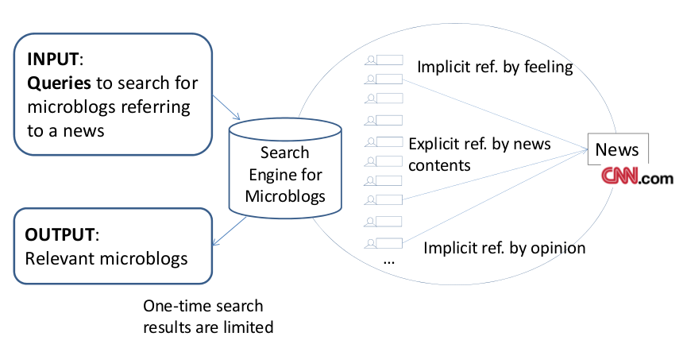
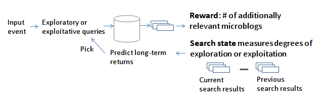
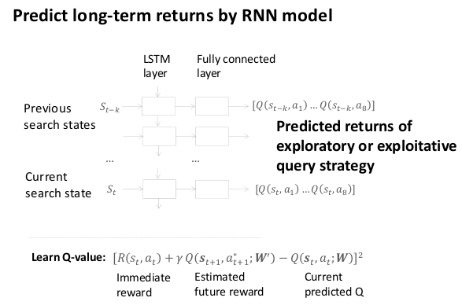
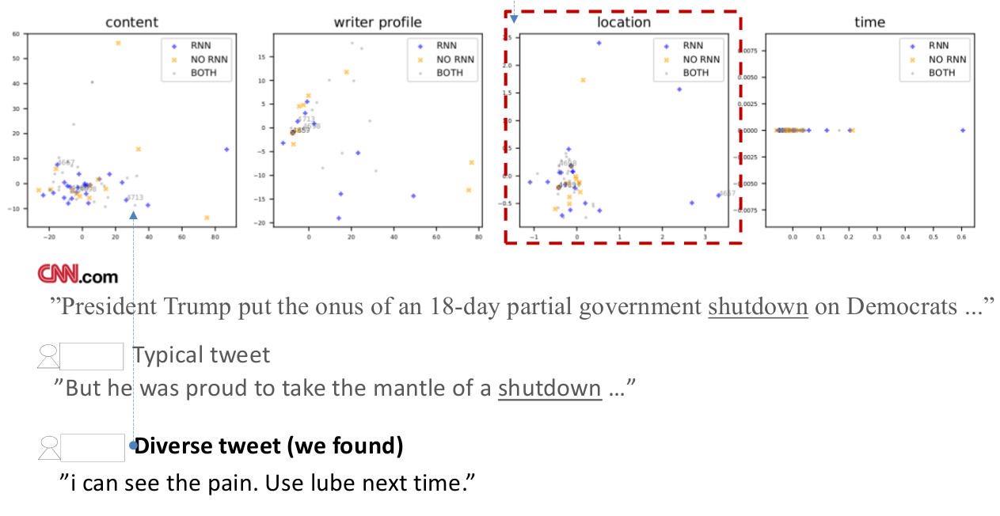

# Search by Deep Reinforcement Learning
Search tweets referring to news, by Deep Reinforcement Learning (PhD work)

## Tweet Search Problem

## Search process

We model search process by Markov Decision Process in Reinforcement Learning. \
Please refer to some open materials.

In MDP-based search process, we define

**Immediate Reward**:
Number of relevant tweets in current search results of tweets. \
(Note that search results are returned by one-time query to a set of tweets)

**State**:
Difference between current search results (tweets) and previous search results (tweets). \
E.g., one difference value is the difference value between textual contents, modeled by Word2Vec model.

**Reinforcement Learning**
We learn by Q-learning,

*R*: immediate reward \
*Q()*: predicted long-term return \
*s_t*: state at time t \
*a_t*: action (query strategy) used at time t

## Model
### Predict Long-term returns of search process by RNN Model

## Search results we found

